**Note:** The CAD model of the assembly and the PDF versions of all drawings are available in the [`cad`](https://github.com/Global-Health-Engineering/glass-tumbler/tree/main/cad) directory of the GitHub repository.

The mechanical design of the tumbler is inspired by a concrete mixer configuration to enable ease of loading and unloading glass. The following two tutorials on building DIY concrete mixers served as primary sources of inspiration:

* [Design using an 11kg gas cylinder as a drum](https://www.youtube.com/watch?v=cXIDimhZ2z8)
* [Design using an oil barrel as a drum](https://youtu.be/vJwhrh9DE5g?si=aXEkfoyNJi_KFIie)

If you intend to build a similar design, watching these videos is highly recommended, as they provide valuable insights into the manufacturing process.

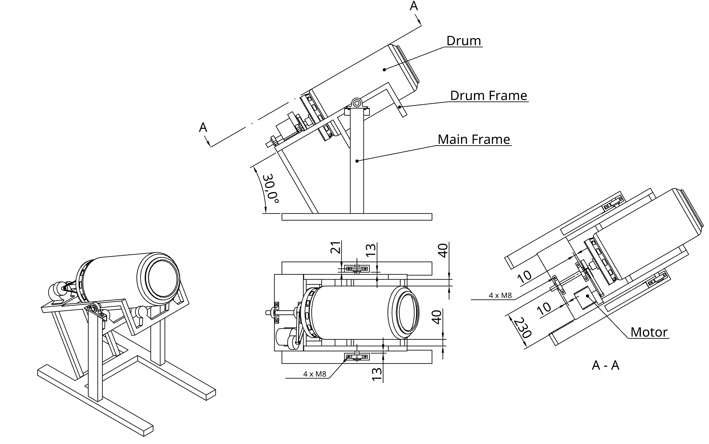

Figure 1 shows the final assembly drawing of the tumbler with its individual components. The wall thickness of all metal components is at least 2mm to facilitate easier welding.

## Frames

First, the inner (drum) frame is constructed from 30x30x2mm steel beams. The dimensions are shown in Figure 2. Although the technical drawing includes two sets of castor wheels, one set is actually sufficient; the rear section holding the second set may be omitted. A metal plate is mounted at the back of the inner frame to hold the bearings and the motor. In this specific build, a 5mm thick plate was used. To ensure a stronger weld for the 25mm shafts, two 25mm holes were pre-drilled for the shafts to sit in. Because the ideal position of the castor wheels depends on their specific size, their attachment points should be adjustable. It is best to attach these during a later phase once the drum shaft is seated on the inner frame.

Next, the legs of the outer frame are constructed from 80x40x2mm steel beams. To increase weld strength, two 80x40mm slots are cut into the base beams so the legs can be inserted into the feet before welding.

The two main bearings are attached to the outer frame legs using angle irons and M8 bolts. Two additional bearings are attached to the front and back of the inner frame’s backplate to support the drum shaft. The inner frame is then aligned between the two legs to determine the final length of the connection beams. **Note:** The two legs of the outer frame should only be welded together while the inner frame is positioned between them (see Figure 2).

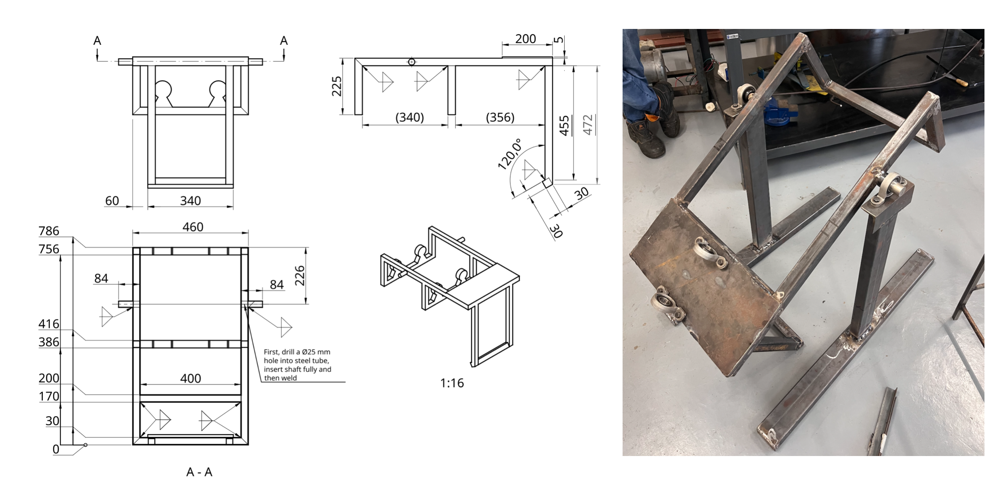

Once the first connection beam is welded, additional reinforcement beams can be added (see Figure 3). In this design, the outer frame is further reinforced with beams at the base and crossbeams to stabilize the legs. This step is highly recommended if sufficient material is available.

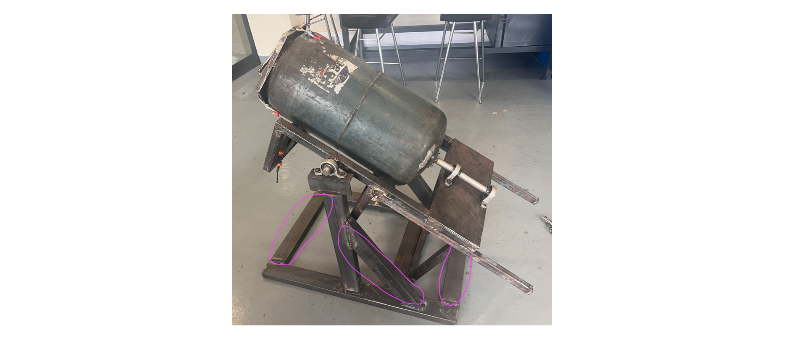

Figure 4 provides the dimensions and additional manufacturing notes for the outer (main) frame. Note that it does not contain the reinforcement beams as these were added after the CAD design had been completed. 

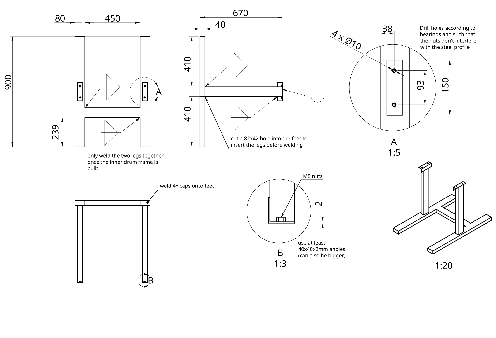

## Drum

A 19kg LPG cylinder (32cm diameter, 85cm height) was chosen for its wall thickness and abrasion resistance. As this is an uncommon size, it was sourced via Facebook Marketplace in Blantyre.

**Safety Warning:** Ensure all gas has been completely purged from the cylinder. This is achieved by opening the valve and letting it vent overnight (after all usable gas is exhausted). The cylinder must then be filled completely with water and emptied to displace any remaining gas pockets. This step is critical for safety before cutting.

Once the drum is completely purged, use an angle grinder to make several cuts (see Figure 5):

1. Cut the top lip off from the top of the cylinder; this will be reused as the rim for the new opening.
2. Remove the handle.
3. Cut a round hole the size of the handle.
4. Remove the base.

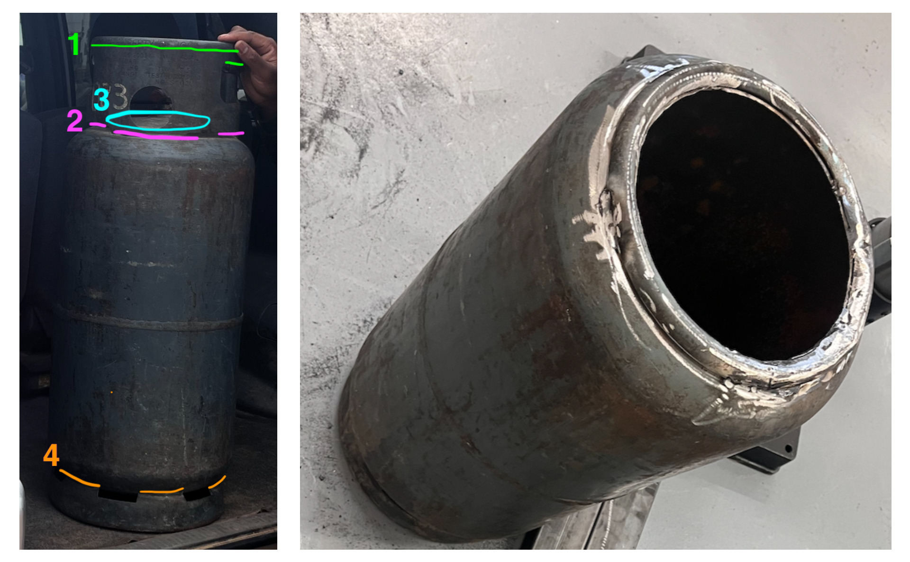

Once these cuts are complete, the lip removed from the top can be welded back onto the newly cut hole (see Figure 5).

The next step is to attach the shaft to the back of the drum. This must be done with great precision to ensure the shaft's axis is perfectly aligned with the drum's axis. A custom flange was fabricated using a lathe (see Figure 6) and welded onto the 25mm shaft. While initial attempts were made to weld the flange directly to the drum, this resulted in warping and axial misalignment. Consequently, four holes were drilled into the drum, and the flange was secured using four M6 bolts. These holes were sealed with epoxy putty on both the interior and exterior to ensure the drum remains watertight. Final tightening and alignment should be performed while the drum is mounted to the inner frame. By rotating the drum manually, you can check for wobbling; minor misalignments can be corrected by placing thin metal shims under the bolts.

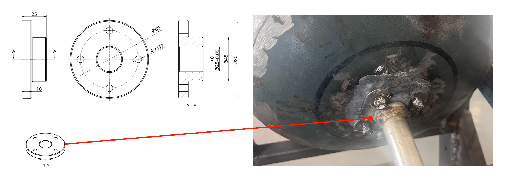

Although the bearing seats are designed to prevent axial displacement, a heavy load of glass puts immense pressure on these seats, which may loosen over time and cause the drum to slide backward. To prevent this, an additional support wheel (see Figure 7) was added to the inner frame's drum plate. As this was a later modification, it is not shown in the CAD model.

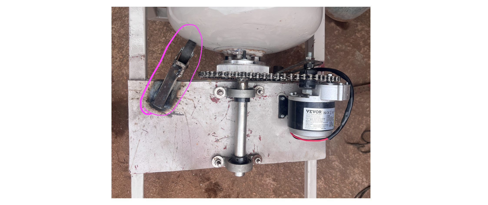

### Drum Lid

The lid features a hexagonal design where the inner triangle fits snugly around the drum's lip, and the outer triangle aligns with the toggle latches on the drum wall (see Figure 8). The interior is lined with a rubber seal (standard door/window weatherstripping).

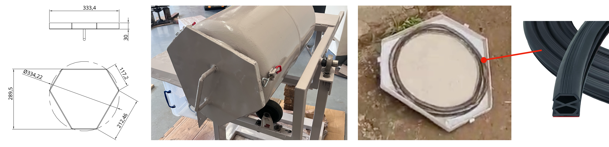

## Drivetrain

Although a belt drive was initially planned, it proved unreliable, and the system was converted to a **bicycle chain drive**. The gear ratio from the motor to the bike sprocket is 1:6. While the sprocket can be welded directly to the shaft, this often causes warping, resulting in poor chain rotation. Instead, the sprocket is bolted to a connection part that is itself welded to the shaft. A chain tensioner was also added to allow for adjustments (see Figure 9). Once the drivetrain was completed, a lockable protective cover was added to prevent theft and protect the motor. This housing includes a door for easy access during maintenance and repairs.

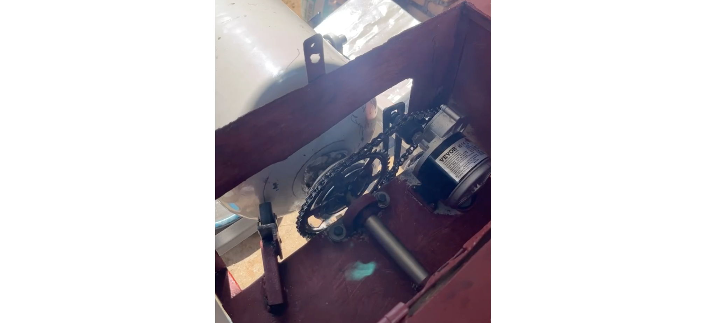

## Electronics

The following electronic components were used:

* **[24V DC Motor](https://amzn.eu/d/06L4CkVM):** A 350W motor with an integrated planetary gearbox (310 RPM max). With the 1:6 gear ratio, the speed is reduced to approximately 51 RPM, which is ideal for a 30cm diameter drum (the optimal range is 35–50 RPM). Testing showed the tumbler uses a maximum of 110W when full, so a less powerful motor would also suffice.
* **[DC-DC Converter](https://amzn.eu/d/0bTFwdRn):** A high-capacity 1000W converter with an integrated cooling fan. When selecting a converter, ensure the solar panel voltage fits within the input range (25–90V in this case) and the motor's nominal voltage fits the output range (2.5–50V). An oversized converter is recommended to prevent overheating during long operation cycles. The output voltage is tuned via a potentiometer screw on the unit.
* **[PWM Controller](https://amzn.eu/d/0d9MLGuE):** This model features an integrated on/off switch, LED display, and speed control knob. Ensure the controller is compatible with your motor's voltage and rated current.
* **Solar Panel:** The system is powered by a 260W solar panel featuring a maximum power voltage ($V_{mp}$) of 41.3V and an open-circuit voltage ($V_{oc}$) of 49.2V. While a second identical panel was purchased and can be wired in parallel to double the available solar capacity, a single-panel configuration proved sufficient for most weather conditions during testing.
* **[50A Circuit Breaker](https://amzn.eu/d/0d3LKDwU), [25A Circuit Breaker](https://amzn.eu/d/0czYagVh)**: DC-rated circuit breakers were used to protect and easily isolate the circuit.
* **[Voltmeter/Ammeter](https://amzn.eu/d/03LGwiDu):** Used to monitor voltage and current before and after the converter. While optional, it is very helpful for troubleshooting and monitoring power consumption.
* **[Bicycle Tachometer](https://www.decathlon.ch/de/p/velocomputer-kabellos-bc-120/346167/m8799862):** Used to keep track of the total rotations the tumbler performed (as this is weather-dependant). It is also an optional component that was simply helpful for data collection purposes.

The electronics were wired according to the layout shown in Figure 10, which also illustrates the component placement within the electronics box. For all primary power connections, standard **10 AWG (6 mm²)** solar wire was used, terminated with corresponding ring ferrules to ensure secure and low-resistance contact points.

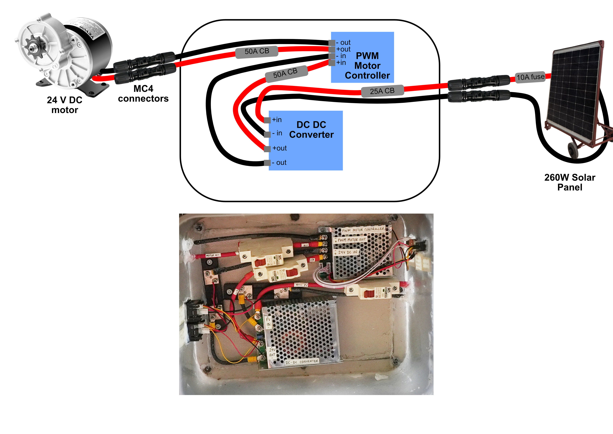

For a more comprehensive explanation, please refer to the [**Detailed Guide PDF**](doc/detailed_guide.pdf), specifically Section 4: Detailed System Description, located in the [`doc`](https://github.com/Global-Health-Engineering/glass-tumbler/tree/main/doc) directory of the GitHub repository.

## Solar Panel Stand

Because the operating site in Cape Maclear is not monitored overnight, the solar panel is stored indoors when not in use. To facilitate this, a mobile and adjustable solar panel stand was constructed, as shown in Figure 11. It was constructed using 40mm angle irons. 

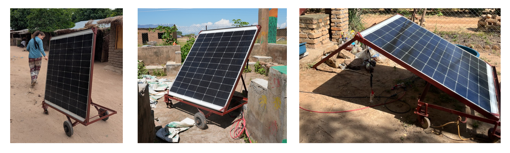

The stand is equipped with four wheels — two fixed wheelbarrow wheels for stability on uneven terrain and two rotating castor wheels — allowing the entire assembly to be easily transported between the storage location and the tumbler. Additionally, the stand features a hinged frame and a support leg that allow the solar panel to be tilted to the optimal angle for maximum solar intake throughout the day.