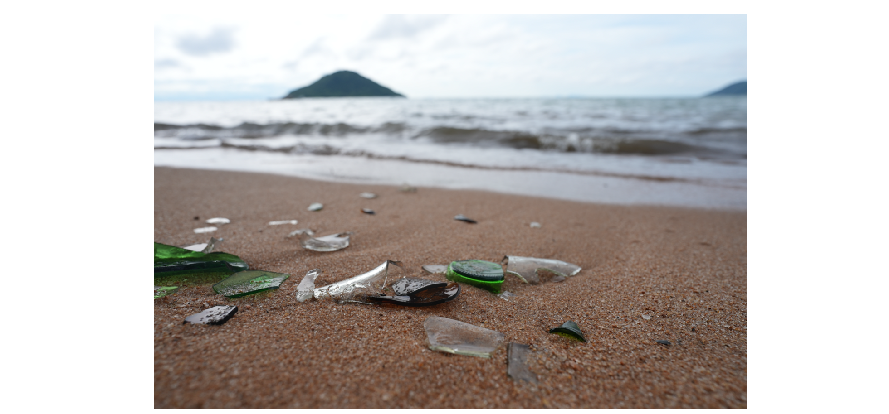

<!-- badges: start -->

<!-- badges: end -->

**Contributors**

- **Emma Steinke** &mdash; [ 0009-0005-9115-9379](https://orcid.org/0009-0005-9115-9379) &mdash; *design, construction, testing, writing*
- **Jakub Tkaczuk** &mdash; [ 0000-0001-7997-9423](https://orcid.org/0000-0001-7997-9423) &mdash; *supervision, page development & maintenance*
- **Elizabeth Tilley** &mdash; [ 0000-0002-2095-9724](https://orcid.org/0000-0002-2095-9724) &mdash; *supervision*

This repository details the construction, operation, and maintenance of the glass crusher built as part of a collaboration between the Malawian community-based organization, Sustainable Cape Maclear, and the Global Health Engineering Group at ETH Zürich.

## Introduction

Cape Maclear is a rural Malawian town located within a UNESCO World Heritage Site, which has attracted a lot of tourism and growth in the last 20 years. This has led to a unique waste challenge: an abundance of non-returnable glass bottles that are not part of a deposit system. As shown in Figure 1, this broken glass creates sharp fragments that pose significant injury risks to residents, tourists, and wildlife.

Because industrial recycling is not economically or technically feasible in this location, this project utilizes **glass tumbling** to grind away sharp edges. This process produces smooth "sea glass," which is safe for reuse in construction, landscaping, and jewelry. The transformation from sharp fragments to smooth glass is illustrated in Figure 2.

## Tumbler Overview

The machine is a standalone, solar-powered rotating drum system designed to process batches of glass. An overview of the full assembly can be seen in Figure 3.

The system operates through five core stages:

1. **Solar Harvesting**: A 260 W solar panel generates DC electricity from sunlight.
2. **Power Regulation**: An electronics box containing a DC-DC converter and PWM motor controller stabilizes the variable solar voltage to a consistent 24 V.
3. **Mechanical Drive**: A 350 W 24 V DC motor converts electrical energy into rotational motion.
4. **Power Transmission**: A bicycle chain and sprocket system transmits torque to a shaft attached to the rear of the drum.
5. **Rotating Drum**: A 19 kg LPG cylinder serves as the tumbling vessel.

### Key Specifications

* **Capacity**: The drum has a volume of 38.5 l and can processes **20 kg** of glass per batch (typically requiring 8–10 hours of tumbling for the best finish). It operates with the drum being around half-full.  
* **Operating Speed**: The drum is typically run at 40 RPM but can reach speeds up to 57 RPM. 
* **Direct Solar (Battery-Free) Design**: The system operates without a battery buffer, making the motor's performance directly dependent on real-time solar irradiance. When sunlight is abundant, the tumbler maintains its preset operating speed. If irradiance drops—due to cloud cover, panel shading, or a suboptimal angle of inclination—the system slows down accordingly. 

## Part List

The total cost to manufacture the system is approximately **$581.10**. A detailed breakdown of the components, specifications, and procurement origins is provided in the table below.

| Item | Specification | Origin | Qty | Unit ($) | Total ($) |
| :--- | :--- | :---: | :---: | :---: | :---: |
| **Drivetrain** | | | | | **56.50** |
| DC Motor | 350 W | CH | 1 | 48.00 | 48.00 |
| Sprocket | Bicycle 410, 48T | MW | 1 | 5.30 | 5.30 |
| Chain | 1/2" x 1/8" x 114 L | MW | 1 | 3.20 | 3.20 |
| **Electronics** | | | | | **123.00** |
| DC-DC Converter | 50 A, 1000 W | CH | 1 | 41.00 | 41.00 |
| PWM Controller | 10 – 55 V | CH | 1 | 22.00 | 22.00 |
| Circuit Breakers | 25 A | CH | 3 | 9.00 | 27.00 |
| Ring Ferrules | 3, 4, 5 mm ID | CH | 20 | 0.13 | 2.50 |
| Fuses | 10 A | CH | 2 | 0.25 | 0.50 |
| Tachometer | Model BC 120 | CH | 1 | 20.00 | 20.00 |
| Volt/Amp Meter | 0–100 V, 50 A | CH | 2 | 5.00 | 10.00 |
| **Finishing** | | | | | **85.10** |
| Enclosure | 350 mm x 250 mm x 200 mm | MW | 1 | 6.70 | 6.70 |
| Motor Cover | 460 mm x 350 mm x 250 mm | MW | 1 | 6.60 | 6.60 |
| Lid Seal | 10 mm x 12 mm | CH | 1 | 16.00 | 16.00 |
| Surface Treat. | 2K Paint/Red Oxide | MW | 1 | 55.80 | 55.80 |
| **Housing** | | | | | **222.80** |
| Gas Cylinder | 19 kg (300 mm ID) | MW | 1 | 78.90 | 78.90 |
| Steel Beam (L) | 80 mm x 40 mm x 2 mm (6 m) | MW | 1 | 44.50 | 44.50 |
| Steel Beam (S) | 30 mm x 30 mm x 2 mm (6 m) | MW | 1 | 23.70 | 23.70 |
| Steel Sheet | 460 mm x 200 mm x 5 mm | MW | 1 | 9.20 | 9.20 |
| Bearings | 25 mm ID | CH | 1 | 0.00 | 0.00 |
| Shaft | 25 mm OD | CH | 1 | 0.00 | 0.00 |
| Steel Offcuts | Various Dimensions | MW | 1 | 8.90 | 8.90 |
| Castor Wheels | Ø 100 mm | MW | 2 | 2.10 | 4.20 |
| Small Wheel | 50 mm x 19 mm | CH | 1 | 4.00 | 4.00 |
| Toggle Clamp | 150 kg Capacity | CH | 4 | 5.00 | 20.00 |
| Lid Metal | 400 mm x 400 mm x 3 mm | MW | 1 | 7.90 | 7.90 |
| Fasteners | M6, M8, M10 | MW | 1 | 10.30 | 10.30 |
| Welding Rods | Ø 2.5 mm | MW | 1 | 11.20 | 11.20 |
| **Solar PV** | | | | | **93.70** |
| Solar Panel | 260 W | MW | 1 | 69.70 | 69.70 |
| Connectors | MC4 Standard | CH | 6 | 4.00 | 24.00 |
| **GRAND TOTAL** | | | | | **$581.10** |

**COO Key:** MW = Malawi (Local Procurement), CH = Switzerland (Imported)