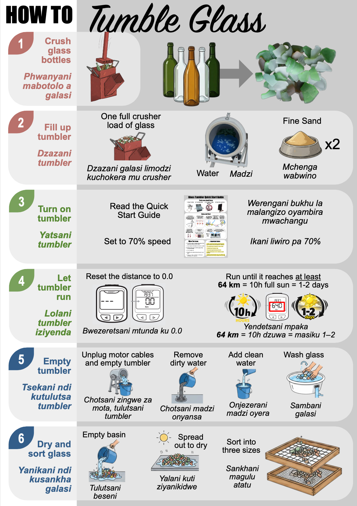
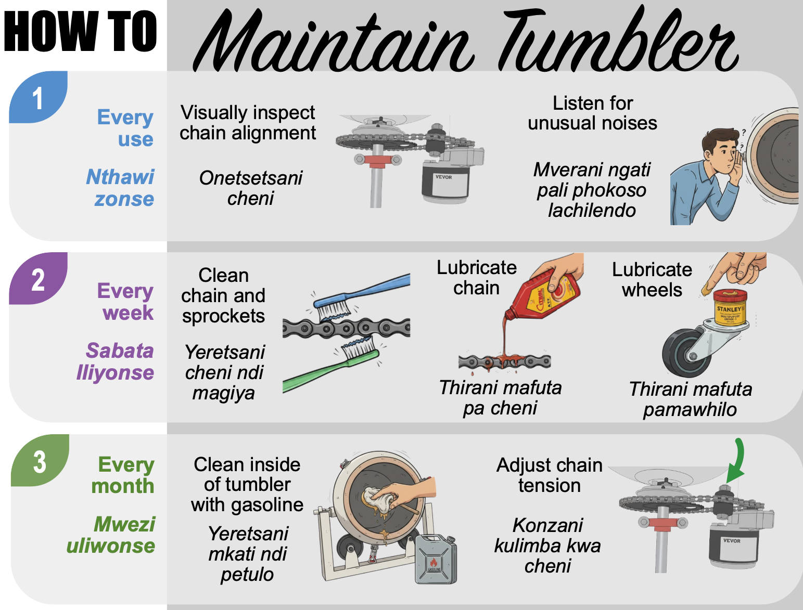

This guide provides a visual overview of how to operate and maintain the solar-powered glass tumbler. 

## How to Tumble Glass

The following graphic explains the step-by-step process for loading, processing, and unloading glass to achieve a smooth "sea glass" finish.

The [quick start guide](doc/quickstart_guide.pdf) for this tumbler design can be found on the GitHub repository in the [`doc`](https://github.com/Global-Health-Engineering/glass-tumbler/tree/main/doc) directory.

## How to Maintain the Tumbler

Regular maintenance ensures the longevity of the machine and the safety of the operator. Please refer to the maintenance chart below for maintenance tasks.

## Troubleshooting

In the event of a mechanical failure, electrical issue, or unexpected behavior of the machine, do not attempt unauthorized repairs. All diagnostic procedures, electrical schematics, and repair instructions are located in the comprehensive troubleshooting manual in this GitHub repository: [**Detailed Guide PDF**](doc/detailed_guide.pdf).
*See **Section 2: Troubleshooting** for specific guidance on resolving system issues.*