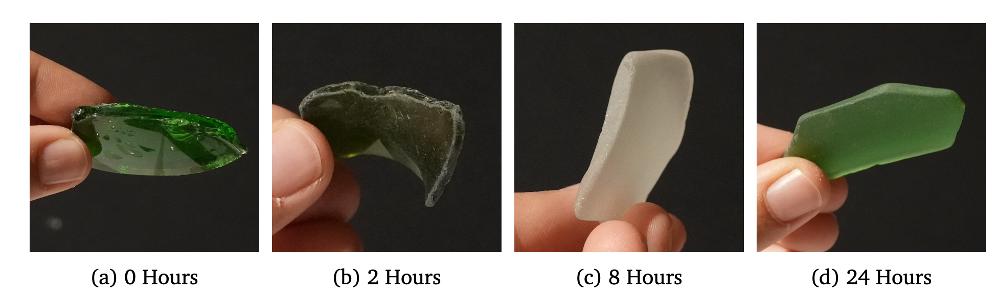
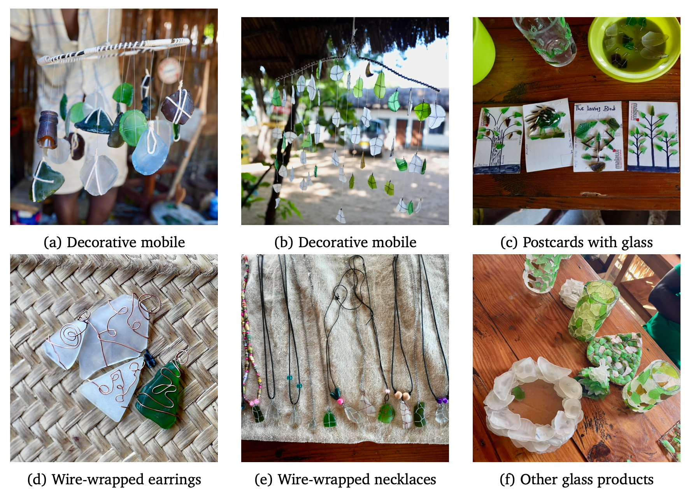

This page summarizes the performance, operational lessons and financial viability of the solar-powered glass tumbler based on data collected in February 2026.

## 1. Operational Performance

During its initial deployment from February 3 to February 27, the tumbler was operational for **118.5 hours**. It successfully produced nine batches of tumbled glass, with each batch weighing approximately 20 kg. The process effectively transforms sharp, hazardous glass shards into smooth, safe "sea glass".

## 2. Process Optimization

Experimental trials were conducted to determine the most efficient parameters for a high-quality finish:

* **Optimal Duration**: A 10-hour cycle is recommended to maximize quality. While much of the smoothing happens in the first few hours, "tumbledness" reaches a point of diminishing returns at the 8 to 10-hour mark (see Figure 1).
* **Abrasive Media**: The addition of a fine abrasive is mandatory for a nice finish. Trials using "just water" resulted in increased structural damage to the glass.
* **Viability of Local Sand**: Locally sourced fine sand performed nearly as well as industrial silicon grit. Given its zero cost and high availability in Malawi, local sand is the superior choice.

## 3. System Efficiency

* **Power Draw**: At the standard operating speed of 40 RPM, the system maintains a constant power draw of **79 W**. Even at 100% speed, the draw was 107.1 W.
* **Annual Yield**: A single-panel (260W) setup is projected to yield **4'274 kg per year**, while a dual-panel (520W) setup can reach **5'060 kg per year**.

## 4. Financial Viability

The total material cost (CAPEX) for the standard 260W system was **$581.10**. The **Minimum Viable Price** represents the break-even point required to cover all annual operating costs and amortized construction costs over a 5-year equipment lifetime.

| Metric | 260W Setup | 520W Setup |
| :--- | :---: | :---: |
| Annual Yield | 4'274 kg  | 5'060 kg  |
| **Minimum Viable Price (USD per 100 kg)** | **$4.94** | **$4.40**  |

## 5. Reuse and Creative Outcomes

Tumbled glass is already being integrated into the local economy in Cape Maclear. Local artisans have explored the material's creative potential, producing jewelry and decorative items (see Figure 2).

